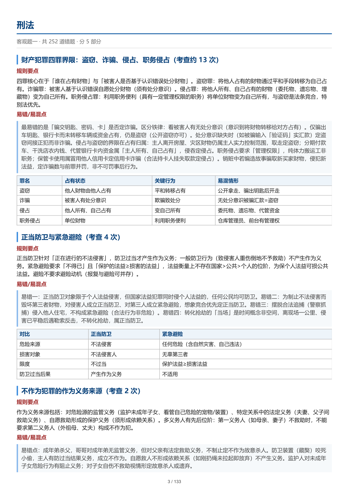
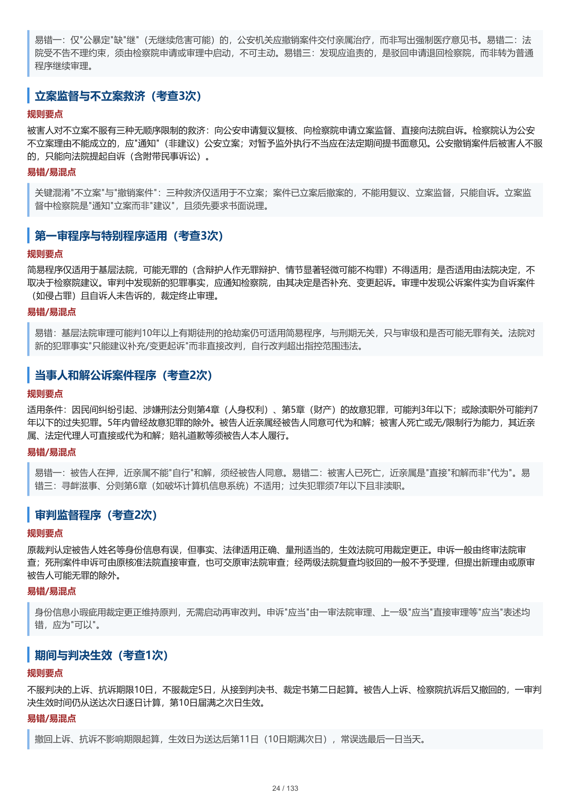

English · [简体中文](./README.zh-CN.md)

# zhuma-fakao-review · ZhuMa Bar-Exam Wrong-Answer Review Assistant


[](https://github.com/1438388098-glitch/zhuma-fakao-review/actions/workflows/ci.yml)

> **In one line** — A multi-agent pipeline that turns a bar-exam app's wrong-answer book into printable, subject-wise study notes (PDF). Seven stages: authenticated read-only scraping (resumable, atomic writes, circuit breaker) → knowledge-point merging → six-dimension AI review loop where P0 findings must be fixed and re-reviewed → typeset PDF with bookmarks. Ships with 22 tests including anti-"fake green light" guards, CI, and a [security self-audit](SECURITY_AUDIT.md) that found and fixed a High-severity credential issue — and then corrected its own inflated first-pass score.

Turn the **entire wrong-answer book** of the ZhuMa bar-exam prep app (zhumavip.com) into **subject-wise, recite-ready knowledge-point notes (PDF)** — with a six-dimension AI review loop.

> This is not "copying the questions over". It reverse-derives the repeatedly-tested knowledge points behind your wrong answers, fills in **error-prone / easily-confused points**, and adjusts the level of detail to your own weak subjects, review progress and study habits.

This is also a [ZCode / Claude Code](https://code.claude.com) **skill package**: drop it into your skills directory and the AI agent will orchestrate the scripts and subagents through the seven-stage flow in `SKILL.md` — you only scan a QR code and answer a few questions.

---

## ✨ Features

- **Full-volume scraping**: goes through ZhuMa's internal read-only APIs (no submitting answers, no touching answer records) to get question stems, options, **correct answers** and **full official explanations** — an information density page scraping cannot reach. Measured: 1,655 wrong answers scraped in about 9 minutes, with resumable checkpoints, atomic writes, and circuit-breaker backoff.
- **Personalized notes**: first asks about your situation (weak subjects / review round / days to the exam / daily study hours / habits / goals), then merges and deduplicates by knowledge point (not question order), tagging "tested N times".
- **Six-dimension review loop**: after the notes are generated, multiple subagents review them in parallel by "subject × dimension" (legal-provision accuracy / answer consistency / coverage completeness / format compliance / student fit / cross-unit cohesion) and aggregate into a revision list; P0 issues must be fixed and re-reviewed. The aggregation script has a built-in guard: **if it cannot parse any findings, it errors out immediately — it never produces a fake "no revisions needed" green light**.
- **Compact typeset PDF**: per-subject volumes + optional master volume (cover / table of contents / PDF bookmarks), three typography-density presets, ready to print or annotate on a tablet. "Error-prone / easily-confused points" appear as light-blue blocks (the visual protagonist of the notes), and the whole style is **grayscale-safe** — labels and hierarchy remain distinguishable on a black-and-white printer.
- **Defensive engineering**: every JSON file is written atomically (an interruption leaves no truncated files), process locks prevent concurrent runs, login state lives only in the local browser profile, and subagent prompts carry anti-injection clauses and write-path whitelists.

## 🔄 Workflow

```mermaid
flowchart LR
    A["Stage 0\nAlignment + student profile"] --> B["01_login.js\nQR login (fixed profile)"]
    B --> C["02_scrape.js\nFull scrape (resumable)"]
    C --> D["03_build_units.js\nSplit into subject units"]
    D --> E["Stage 4\nParallel note generation by subagents"]
    E --> F["Stage 5.1\nSix-dimension parallel review"]
    F --> G["05_review_aggregate.js\nAggregate → revision list"]
    G --> H["Stage 5.3–5.4\nRevise + P0 re-review"]
    H --> I["04_render_pdf.js\nRender per-subject PDFs / master volume"]
    I --> J["Stage 7\nFinal delivery"]
```



> Mind the execution order: **the aggregation script `05` runs BEFORE the rendering script `04`** — review and revise first, render and deliver last. A subject with up to 250+ questions is split into units of ≤ 55 questions, handed to parallel subagents separately.

## 🚀 Quick Start

### 0. Prepare the environment

- Windows + a local **Google Chrome or Microsoft Edge** install (or point `CHROME_PATH` at one; macOS/Linux detection logic exists but is untested)
- Node.js ≥ 18, with `playwright-core` installed (pin the version; PDF bookmarks require ≥ 1.42):

```bash
npm install playwright-core@1.49.1 --prefix <isolated-dir>
export NODE_PATH=<isolated-dir>/node_modules
node -e "require('playwright-core')"   # verify install; no output means OK
```

### 1. Install as a skill

```bash
# Clone into your skills directory (ZCode / Claude Code discovers SKILL.md automatically)
git clone https://github.com/1438388098-glitch/zhuma-fakao-review.git ~/.zcode/skills/zhuma-fakao-review
```

Then tell the AI "organize my ZhuMa wrong answers into notes" with the error-book link to trigger it; or run the scripts manually as below.

### 2. Run the pipeline manually (optional)

```bash
# 1. Login (shows a QR code; scan it with the ZhuMa app; --wait-min adjusts polling, default 12 minutes)
node scripts/01_login.js --work D:\fakao-2026

# 2. Full scrape (--delay defaults to 150ms, floor 100ms)
node scripts/02_scrape.js --work D:\fakao-2026 --groups 1,2

# 3. Split into processing units (rerunning rebuilds units/; existing notes must be regenerated)
node scripts/03_build_units.js --work D:\fakao-2026 --chunk 55

# 4-5. Generate & review notes — dispatched by the AI agent as parallel subagents per units_manifest.json
#      Prompt templates: assets/note_prompt_template.md, assets/review_prompt_template.md
node scripts/05_review_aggregate.js --work D:\fakao-2026   # aggregate the revision list (BEFORE rendering!)
#      Dispatch revision subagents for subjects with P0/P1 findings, re-review when necessary

# 6. Render PDFs
#    --volume builds the master volume (by default decided by study_profile.json's output_granularity; --no-volume to skip)
node scripts/04_render_pdf.js --work D:\fakao-2026 --volume --desktop
```

**Script exit codes**: `0` success; `1` finished but with failures/missing items (just rerun to resume); `2` preconditions unmet (each script's file header documents the exact semantics, e.g. 02's 2 = not logged in, 01's 2 = QR code not found, 03/05's 2 = missing inputs or bad arguments).

## 📊 Measured scale of one full run

| Metric | Value |
|---|---|
| Subjects | 18 (Objective Test I: 9 + Objective Test II: 9) |
| Chapters with questions | 180 |
| Unique wrong answers | 1,655 (chapter-level expectations sum to 1,661; the difference is questions repeated across chapters, deduplicated by id) |
| Processing units | 41 (≤ 55 questions each) |
| Scrape time | about 9 minutes |
| Note-generation subagents | 39 (5 parallel batches; 2 units were hand-written by the main agent due to 429 rate limiting) |
| Output | 18 per-subject PDFs (about 10.1 MB) + a 133-page master volume (about 4.0 MB) |

## 🖼 Sample output

<p align="center">
  
  
</p>

> Inner pages of the master volume (left: opening of the Criminal Law section; right: an inner page of Criminal Procedure). The light-blue blocks are the "pitfall / confusion points" — the visual centerpiece of the notes; on a grayscale printer they degrade into bordered quote blocks.
>
> Data source: the author's own real error-book export (1,655 questions from ZhuMa), rendered to PDF entirely locally before screenshotting; the screenshots were manually reviewed page by page and contain no phone numbers, account names, real names, or other personal information.

## 📚 Documentation map

| File | Contents |
|---|---|
| [SKILL.md](SKILL.md) | Skill entry point: goal / scenarios / inputs & outputs / seven-stage flow (executed by the AI agent) |
| [references/api_reference.md](references/api_reference.md) | ZhuMa internal APIs: auth headers, parameters and response fields of the three core endpoints, error codes, and how to re-discover endpoints when they change |
| [references/workflow.md](references/workflow.md) | End-to-end flow in detail, environment conventions, pitfalls |
| [references/review_dimensions.md](references/review_dimensions.md) | Definitions of the six review dimensions, what to catch, severity grading, dispatch method |
| [references/student_profile.md](references/student_profile.md) | Full student-profile questionnaire, field meanings, how it maps to note style |
| [assets/note_prompt_template.md](assets/note_prompt_template.md) | Note-generation subagent prompt template (fill in parameters and use) |
| [assets/review_prompt_template.md](assets/review_prompt_template.md) | Review / revise / re-review subagent prompt templates |
| [assets/pdf_style.css](assets/pdf_style.css) | PDF typography styles (compact / standard / relaxed, driven by CSS variables) |
| [examples/example_run.md](examples/example_run.md) | Full walkthrough example: from one sentence to 18 PDFs |
| [SECURITY_AUDIT.md](SECURITY_AUDIT.md) | Security audit: methodology, fix records, residual risks |

## 🔒 Privacy and data flow (please read)

> [!IMPORTANT]
> The workflow as a whole has two channels that take data off this machine. Know this before use:

- **Read-only toward the ZhuMa platform**: no submitting answers, no altering account data; serial scraping with a default 150 ms interval, fetching only the wrong answers of **your own account** — please comply with the platform's terms of service.
- **Script network egress is `zhumavip.com` only**: every URL is hardcoded to the official domain, no third-party reporting.
- **① AI model services**: the Stage 4/5 subagents are LLM-driven; wrong-answer content and the student profile you fill in are sent, as prompts, to whichever model provider you use. The data is used only to generate notes.
- **② Cloud-synced disks**: `--desktop` copies the master-volume PDF to your desktop — if the desktop is inside OneDrive sync scope, that file syncs to Microsoft's cloud. Don't pass `--desktop` if you don't want cloud backup.
- **Local sensitive data**: login state (session cookies) is stored only in `<working directory>/scrape/profile/`. The scripts never write any credentials file; do not share that directory, and do not put it in cloud sync or public locations. To wipe it: delete the whole working directory.

## 🛠 Troubleshooting

| Symptom | Fix |
|---|---|
| `playwright-core not found` | Install per Quick Start step 0, set `NODE_PATH`, then retry |
| `No local Chrome / Edge found` | Install a browser, or set `CHROME_PATH` to the executable |
| 02 exits with code 2 | Not logged in or session expired: rerun `01_login.js`, then 02 (already-scraped data is kept) |
| 02 exits with code 1 (some failures) | Just rerun 02; it resumes from the checkpoint |
| 05 exits with code 2 (zero parsed findings) | Review report format mismatch: check the 6-column table and severities written only as P0–P3, then rerun |
| 04 exits with code 1 (missing notes) | Some shards have no notes: rerun the Stage 4 subagents for them, then render |
| Stuck on "another process is running" | Delete `scrape/.scrape.lock` or `scrape/.render.lock` (after confirming no concurrent run) |
| Garbled Chinese in the terminal | Use Git Bash, or run `chcp 65001` first |

## ⚠️ Known limitations

1. **"My wrong choices" are unavailable** — the ZhuMa API always returns `null` for `userOptions` / `userAnswer`: it records which questions were wrong, but not which option you picked. Correct answers and official explanations are complete.
2. **Objective questions only** (Objective Test I / Objective Test II); the subjective-question error book has a different structure and is not supported.
3. **Depends on ZhuMa's internal APIs**; a frontend revamp may break it — then follow "how to re-discover endpoints" in `references/api_reference.md`.
4. **Login sessions expire**; when they do, rerun `01_login.js` and scan again.
5. In the master-volume PDF, chapter numbering restarts inside each unit (mitigated with "Part N (continued)").

## 🧪 Quality assurance

This repository went through two rounds of independent review plus re-review acceptance (security audit, line-by-line code review, documentation-consistency check); all findings were fixed, with the trail left in git history. The security self-audit found and fixed one High-severity issue — a plaintext login-token copy written to disk — and corrected its own inflated first-pass score (95 → 90); see [SECURITY_AUDIT.md](SECURITY_AUDIT.md). Core guarantees:

- Atomic writes + resumable runs: any step can be interrupted and safely re-run, never producing truncated data;
- Failures are visible: every failure warns and affects the exit code — there is no silent data-loss "fake green light" path (the aggregation script errors out on zero parsed findings);
- Injection defense: every rendering path escapes before concatenation; subagent prompts carry anti-injection clauses and write-path whitelists;
- **Platform-agnostic design**: machine-specific probing (Chrome/Edge discovery, desktop directory, Windows reserved-filename sanitization) is centralized in runtime detection in `scripts/lib/env.js`, with no machine-specific paths hardcoded — moving to another machine needs only Node + a local browser, no code changes;
- **Automated tests**: `npm test` (node:test, 22 cases) covers argument parsing, atomic writes, process-lock expiry preemption, unit splitting & manifest, and **anti-"fake green light" guards** (a report with zero parsed findings must exit 2; summary vs table row counts cross-checked), all verified end-to-end via the CLI against temporary directories.

See [SECURITY_AUDIT.md](SECURITY_AUDIT.md) for details.

## 📄 Disclaimer

- This project is an **unofficial tool for personal learning purposes**, with **no affiliation, cooperation with, or endorsement by** ZhuMa bar-exam prep (zhumavip.com) or its operator.
- The API information recorded in `references/api_reference.md` consists solely of technical observations of **data visible to my own account** made while using the service, for study and exchange only; final interpretation of the APIs belongs to the platform operator, who may change or shut them down at any time.
- By using this tool you understand and agree: **only scrape the wrong-answer data of your own account**, and comply with the platform's terms of service and applicable law; account restrictions or any other consequences caused by misuse (such as high-frequency scraping, commercial use, or scraping other people's data) are borne by the user.
- The scripts access the platform read-only (no submitting answers, no touching answer records) and have built-in rate limiting and backoff; if the platform operator believes this project infringes its rights, please open an Issue and I will act immediately (remove the related content or archive the repository).

## 📄 License

[MIT](LICENSE). Forks and improvements welcome — if the ZhuMa APIs change, please update `references/api_reference.md` accordingly.
